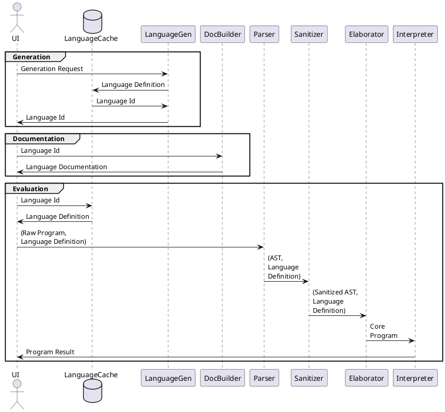

MetaRank Engine
===============

## Overview

The MetaRank Engine generates specifications and interpreters for random programming languages. In addition, it provides input validation for user-written programs.

## Components

* [LanguageCache](./LanguageCache.md)
* [LanguageGen](./LanguageGen.md)
* [DocBuilder](./DocBuilder.md)
* [Parser](./Parser.md)
* [Sanitizer](./Sanitizer.md)
* [Elaborator](./Elaborator.md)
* [Interpreter](./Interpreter.md)

## Data Types

* [Language Definition](./LanguageDefinition.md)
* [Full AST](./FullAST.md)
* [Core AST](./CoreAST.md)